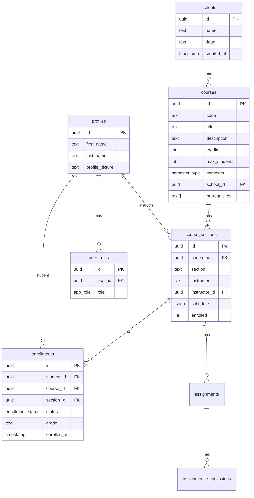

# 🎓 Aca-D-ashboard - Learning Management System

<div align="center">


A comprehensive, production-ready Learning Management System (LMS) built with modern web technologies. UniCourse provides role-based access control, real-time data management, and an elegant, responsive user interface for managing university courses, enrollments, assignments, and grades.

[](https://reactjs.org/)
[](https://www.typescriptlang.org/)
[](https://supabase.com/)
[](https://tailwindcss.com/)
[](https://vitejs.dev/)

</div>

---

## 📋 Table of Contents

- [Problem Statement](#-problem-statement)
- [Objectives](#-objectives)
- [Key Features](#-key-features)
- [Tech Stack](#-tech-stack)
- [Architecture](#-architecture)
- [Database Schema](#-database-schema)
- [Security](#-security)
- [Getting Started](#-getting-started)
- [Project Structure](#-project-structure)
- [Role-Based Access](#-role-based-access)
- [Future Enhancements](#-future-enhancements)

---

## 🎯 Problem Statement

Educational institutions face significant challenges in managing course operations efficiently:

1. **Fragmented Systems**: Course registration, grade tracking, and communication often exist in disconnected systems, creating data silos and administrative overhead.

2. **Manual Processes**: Paper-based or spreadsheet-driven enrollment and grading processes are error-prone, time-consuming, and lack real-time visibility.

3. **Limited Accessibility**: Traditional systems often lack mobile responsiveness and modern UX, creating friction for students and faculty.

4. **Security Concerns**: Protecting sensitive student data while enabling appropriate access for different user roles is complex and often poorly implemented.

5. **Scalability Issues**: Legacy systems struggle to handle concurrent users during peak registration periods.

**Aca-d-ashboard addresses these challenges** by providing a unified, secure, and user-friendly platform that streamlines the entire academic workflow from course creation to grade assignment.

---

## 🎯 Objectives

### Primary Goals

- ✅ **Unified Platform**: Single system for course management, enrollment, assignments, and grading
- ✅ **Role-Based Access**: Secure, differentiated experiences for students, teachers, and administrators
- ✅ **Real-Time Operations**: Instant updates for enrollment status, grades, and announcements
- ✅ **Modern UX**: Responsive, accessible interface that works seamlessly across devices
- ✅ **Data Security**: Row-Level Security (RLS) ensuring users only access authorized data

### Secondary Goals

- ✅ **Schedule Conflict Detection**: Prevent students from enrolling in overlapping courses
- ✅ **Prerequisite Enforcement**: Ensure students meet course requirements before enrollment
- ✅ **Waitlist Management**: Queue students for full sections with automatic notifications
- ✅ **AI Integration**: Built-in AI assistant for student support
- ✅ **Analytics Dashboard**: Administrative insights into enrollment trends and system usage

---

## ✨ Key Features

### 👨‍🎓 For Students

| Feature | Description |
|---------|-------------|
| **Course Catalog** | Browse, search, and filter available courses by school, semester, and keywords |
| **Smart Enrollment** | Section selection with real-time availability, conflict detection, and waitlist |
| **Schedule View** | Weekly calendar visualization of enrolled courses |
| **Assignment Submission** | Upload assignments with file support (PDF, DOCX, images) |
| **Grade Tracking** | View grades, GPA calculation, and academic progress |
| **AI Assistant** | Get help with course-related questions |

### 👨‍🏫 For Teachers

| Feature | Description |
|---------|-------------|
| **Section Management** | View assigned sections and enrolled students |
| **Assignment Creation** | Create, edit, and manage assignments with due dates |
| **Grading Interface** | Grade student submissions with feedback |
| **Enrollment Overview** | Track student enrollment and course capacity |

### 👨‍💼 For Administrators

| Feature | Description |
|---------|-------------|
| **Course Management** | Create, update, and delete courses with full CRUD operations |
| **Section Configuration** | Assign instructors, set schedules, and manage capacity |
| **School Administration** | Manage academic schools/departments and deans |
| **User Management** | View all users and modify roles (student/teacher/admin) |
| **Announcements** | Create system-wide or role-targeted announcements |
| **Analytics** | View enrollment statistics and system metrics |

---

## 🛠 Tech Stack

### Frontend

| Technology | Purpose |
|------------|---------|
| **React 18** | Component-based UI library with hooks |
| **TypeScript** | Type-safe JavaScript for better DX and fewer bugs |
| **Vite** | Fast build tool and development server |
| **Tailwind CSS** | Utility-first CSS framework |
| **shadcn/ui** | Accessible, customizable component library |
| **React Query** | Server state management with caching |
| **React Router** | Client-side routing |
| **React Hook Form** | Performant form handling with Zod validation |
| **Framer Motion** | Smooth animations (via Tailwind) |

### Backend (Supabase)

| Technology | Purpose |
|------------|---------|
| **PostgreSQL** | Relational database with advanced features |
| **Row-Level Security** | Fine-grained access control at the database level |
| **Supabase Auth** | Email/password authentication with session management |
| **Supabase Storage** | Secure file storage for assignments and avatars |
| **Edge Functions** | Serverless functions for AI integration |
| **Realtime** | WebSocket subscriptions for live updates |

### Design System

| Aspect | Implementation |
|--------|----------------|
| **Color Palette** | Teal primary (#21808D) with cream accents |
| **Typography** | Plus Jakarta Sans for modern, readable text |
| **Spacing** | Consistent 4px grid system |
| **Components** | Elevated cards, gradient buttons, semantic badges |
| **Dark Mode** | Full theme support with CSS variables |

---

## 🏗 Architecture

```
┌─────────────────────────────────────────────────────────────────┐
│                        CLIENT (Browser)                          │
├─────────────────────────────────────────────────────────────────┤
│  React 18 + TypeScript + Vite + Tailwind CSS + shadcn/ui        │
│  ├── Pages (Dashboard, Courses, Grades, etc.)                   │
│  ├── Components (Reusable UI components)                        │
│  ├── Hooks (Custom hooks for data fetching)                     │
│  └── React Query (Server state + caching)                       │
└─────────────────────────────────────────────────────────────────┘
                              │
                              │ HTTPS
                              ▼
┌─────────────────────────────────────────────────────────────────┐
│                     SUPABASE (Backend)                           │
├─────────────────────────────────────────────────────────────────┤
│  ┌─────────────┐  ┌─────────────┐  ┌─────────────────────────┐  │
│  │    Auth     │  │   Storage   │  │    Edge Functions       │  │
│  │  (JWT/RLS)  │  │  (Buckets)  │  │    (AI Assistant)       │  │
│  └─────────────┘  └─────────────┘  └─────────────────────────┘  │
│                              │                                   │
│                              ▼                                   │
│  ┌─────────────────────────────────────────────────────────────┐│
│  │                    PostgreSQL Database                       ││
│  │  ┌──────────┐ ┌──────────┐ ┌──────────┐ ┌──────────────────┐││
│  │  │ profiles │ │ courses  │ │ sections │ │   enrollments    │││
│  │  └──────────┘ └──────────┘ └──────────┘ └──────────────────┘││
│  │  ┌──────────┐ ┌──────────┐ ┌──────────┐ ┌──────────────────┐││
│  │  │  schools │ │assignments│ │submissions│ │   user_roles    │││
│  │  └──────────┘ └──────────┘ └──────────┘ └──────────────────┘││
│  │                                                               ││
│  │  Row-Level Security Policies + Security Definer Functions    ││
│  └─────────────────────────────────────────────────────────────┘│
└─────────────────────────────────────────────────────────────────┘
```

---

## 🗃 Database Schema



---

## 🔐 Security

UniCourse implements defense-in-depth security:

### Authentication
- **Supabase Auth**: Secure email/password authentication
- **Session Management**: JWT tokens with automatic refresh
- **Protected Routes**: Client-side route guards based on role

### Authorization
- **Role-Based Access Control**: Three distinct roles (student, teacher, admin)
- **Separate Roles Table**: Prevents privilege escalation attacks
- **Security Definer Functions**: Safe role checking without RLS recursion

### Data Protection
- **Row-Level Security (RLS)**: All tables protected with fine-grained policies
- **User Data Isolation**: Students only see their own enrollments and grades
- **Teacher Restrictions**: Teachers only access their assigned sections
- **Admin Override**: Full access for administrative functions

### Key Security Functions

```sql
-- Check if user has a specific role
has_role(_user_id uuid, _role app_role) → boolean

-- Check if user is instructor for a section
is_instructor_for_section(_user_id uuid, _section_id uuid) → boolean

-- Check profile viewing permissions
can_view_profile(_viewer_id uuid, _profile_id uuid) → boolean
```

---

## 🚀 Getting Started

### Prerequisites

- Node.js 18+ and npm
- Supabase account (or Lovable Cloud)

### Installation

1. **Clone the repository**
   ```bash
   git clone <repository-url>
   cd unicourse
   ```

2. **Install dependencies**
   ```bash
   npm install
   ```

3. **Environment setup**
   ```bash
   # .env file (auto-configured with Lovable Cloud)
   VITE_SUPABASE_URL=your_supabase_url
   VITE_SUPABASE_PUBLISHABLE_KEY=your_anon_key
   ```

4. **Start development server**
   ```bash
   npm run dev
   ```

5. **Open in browser**
   ```
   http://localhost:5173
   ```

### Demo Accounts

After setting up, create users and assign roles via the Users page (admin required):

| Role | Access Level |
|------|--------------|
| **Student** | Enroll in courses, submit assignments, view grades |
| **Teacher** | Manage assigned sections, create assignments, grade students |
| **Admin** | Full system access, manage courses/users/schools |

---

## 📁 Project Structure

```
src/
├── components/
│   ├── admin/           # Admin-specific dialogs and forms
│   ├── announcements/   # Announcement components
│   ├── assignments/     # Assignment submission and grading
│   ├── auth/           # Protected route wrapper
│   ├── courses/        # Course card and enrollment
│   ├── enrollment/     # Section selection dialog
│   ├── grading/        # Grade assignment dialog
│   ├── layout/         # Main layout and sidebar
│   ├── profile/        # Avatar upload
│   └── ui/             # shadcn/ui components
├── hooks/
│   ├── useAuth.ts           # Authentication state
│   ├── useCourses.ts        # Course data fetching
│   ├── useEnrollments.ts    # Enrollment operations
│   ├── useSections.ts       # Section management
│   ├── useAssignments.ts    # Assignment CRUD
│   ├── useScheduleConflicts.ts  # Conflict detection
│   └── ...
├── pages/
│   ├── Auth.tsx         # Login/Signup
│   ├── Dashboard.tsx    # Role-based dashboard
│   ├── Courses.tsx      # Course catalog
│   ├── MyCourses.tsx    # Enrolled courses
│   ├── Assignments.tsx  # Assignment management
│   ├── Grades.tsx       # Grade viewing
│   ├── Schedule.tsx     # Weekly schedule
│   └── ...
├── lib/
│   ├── utils.ts         # Utility functions
│   ├── gradeUtils.ts    # GPA calculation
│   ├── scheduleUtils.ts # Schedule conflict detection
│   └── exportUtils.ts   # CSV export
├── integrations/
│   └── supabase/        # Supabase client and types
└── types/
    └── index.ts         # Shared TypeScript types
```

---

## 👥 Role-Based Access

### Feature Matrix

| Feature | Student | Teacher | Admin |
|---------|:-------:|:-------:|:-----:|
| View course catalog | ✅ | ✅ | ✅ |
| Enroll in courses | ✅ | ❌ | ❌ |
| Drop courses | ✅ | ❌ | ❌ |
| View own grades | ✅ | ❌ | ❌ |
| Submit assignments | ✅ | ❌ | ❌ |
| Create assignments | ❌ | ✅ | ✅ |
| Grade submissions | ❌ | ✅ | ✅ |
| Manage courses | ❌ | ❌ | ✅ |
| Manage users | ❌ | ❌ | ✅ |
| Create announcements | ❌ | ❌ | ✅ |
| View analytics | ❌ | ❌ | ✅ |

### Sidebar Navigation by Role

**Students**: Dashboard, Course Catalog, My Courses, Assignments, Grades, Schedule, AI Assistant

**Teachers**: Dashboard, My Courses, Assignments, Grading, Students, Schedule

**Admins**: Dashboard, Courses, Schools, Users, Grading, Announcements, Analytics, Settings

---

## 🔮 Future Enhancements

### Phase 1: Core Learning Features
- [ ] **Course Modules**: Structured learning content with videos, documents, and text
- [ ] **Discussion Forums**: Threaded discussions for each course section
- [ ] **Quiz System**: Multiple-choice quizzes with auto-grading
- [ ] **Unified Calendar**: Combined view of assignments, quizzes, and events

### Phase 2: Engagement Features
- [ ] **Progress Tracking**: Visual course completion percentage
- [ ] **Real-time Notifications**: In-app and email alerts
- [ ] **Course Reviews**: Student ratings and feedback
- [ ] **Attendance Tracking**: Digital check-in for classes

### Phase 3: Advanced Features
- [ ] **Video Conferencing**: Zoom/Meet integration
- [ ] **Peer Review**: Student-to-student assignment review
- [ ] **Certificates**: Completion certificates with verification
- [ ] **Mobile App**: React Native companion app

---

## 📝 License

This project is available for portfolio demonstration purposes.

---

## 🤝 Contributing

Contributions, issues, and feature requests are welcome!

---

<div align="center">

**Built with using React, TypeScript, and Supabase**

[⬆ Back to Top](#-acadashboard---learning-management-system)

</div>
